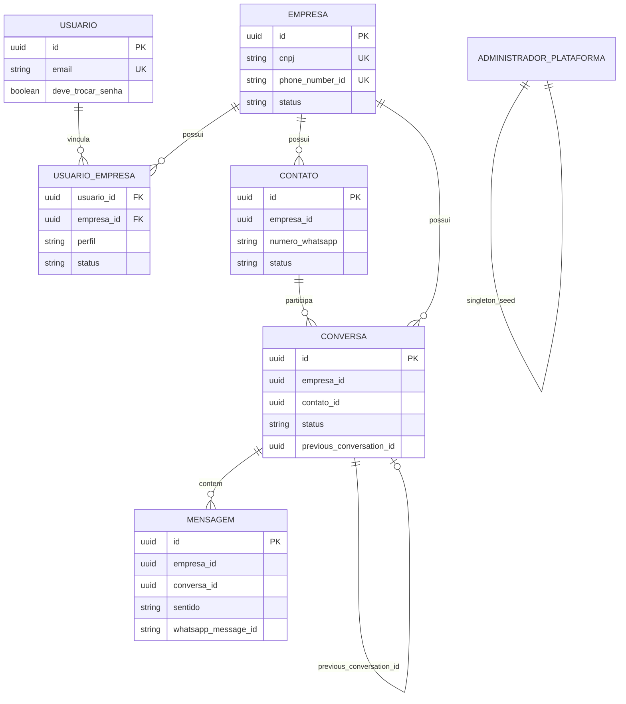

# Modelo de dados

Migrations Flyway em `src/main/resources/db/migration/`.

## Tabelas principais

## Row Level Security

Tabelas de dado de tenant possuem `empresa_id`, com RLS **ENABLE** e
**FORCE**. A policy utiliza `current_setting('app.tenant_id', true)`.

A aplicação define a variável por transação via `set_config(..., true)`
(equivalente a `SET LOCAL`), no aspecto de tenancy, **dentro** da transação
aberta. Índices compostos priorizam `empresa_id`.

Tabelas sem RLS de tenant: `administrador_plataforma` (escopo global).

## Constraints relevantes

| Constraint | Motivo |
|---|---|
| `UNIQUE(empresa_id, numero_whatsapp)` em contato | Número único por tenant |
| Unique parcial em `whatsapp_message_id` | Idempotência de reentrega |
| `UNIQUE(email)` em usuario | Conta global |
| `phone_number_id` único em empresa | Resolução do webhook |

## Papel de aplicação no banco

A aplicação conecta com usuário de runtime distinto do dono Flyway, alinhado
às policies com `FORCE ROW LEVEL SECURITY`.
