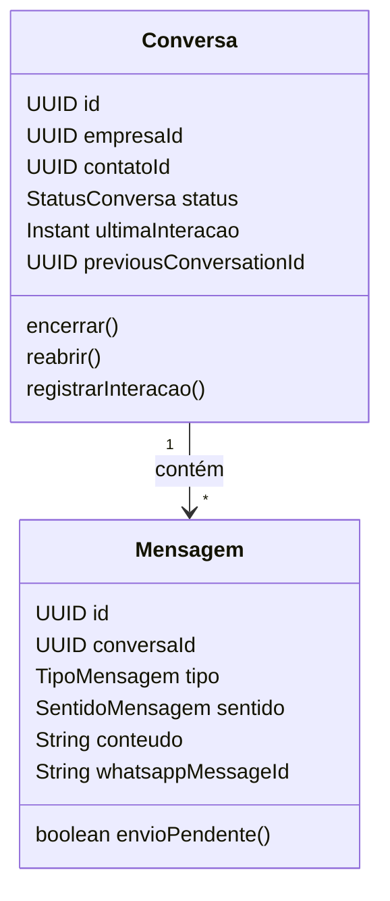

# Domínio

## Conceitos

| Conceito | Descrição |
|---|---|
| Empresa | Tenant. Possui `phone_number_id` opcional para resolução no webhook |
| Administrador da plataforma | Conta separada de `Usuario`; opera empresas |
| Usuario | Conta global (e-mail único) |
| UsuarioEmpresa | Vínculo: perfil (`ADMINISTRADOR` \| `ATENDENTE`) e status por empresa |
| Contato | Cliente do canal no escopo do tenant |
| Conversa | Atendimento com um contato; status `ABERTA` \| `ENCERRADA` |
| Mensagem | Unidade de comunicação; sentido `ENTRADA` \| `SAIDA` |

## Agregado Conversa–Mensagem

Invariantes relevantes:

- Mensagem de saída só em conversa aberta (`Conversa.registrarMensagem` /
  preparação no service). Violação → conflito HTTP (**409**).
- Webhook e entrada autenticada **não** reabrem conversa encerrada: abrem
  nova conversa com `previous_conversation_id` apontando para a anterior.
- Reabertura manual apenas via `PATCH` com `acao=REABRIR`.
- Idempotência de entrada: unique parcial `(empresa_id, whatsapp_message_id)`.

## Soft delete

Exclusão lógica por `status` (`ATIVO` / `INATIVO` ou equivalente). Leitura de
registro inativo responde **404**. Reativação:

- Usuário: `PUT /usuarios/{id}` com `status=ATIVO`
- Contato: novo `POST /contatos` ou fluxo de entrada com o mesmo número
- Empresa: apenas via plataforma (`DELETE` inativa; listagem de inativas à parte)

## Conta e multi-empresa

E-mail de usuário é único globalmente. Perfil e status vivem no vínculo. Um
usuário pode pertencer a várias empresas; a troca de contexto emite novo JWT
(`POST /auth/switch-tenant`) sem nova senha.
