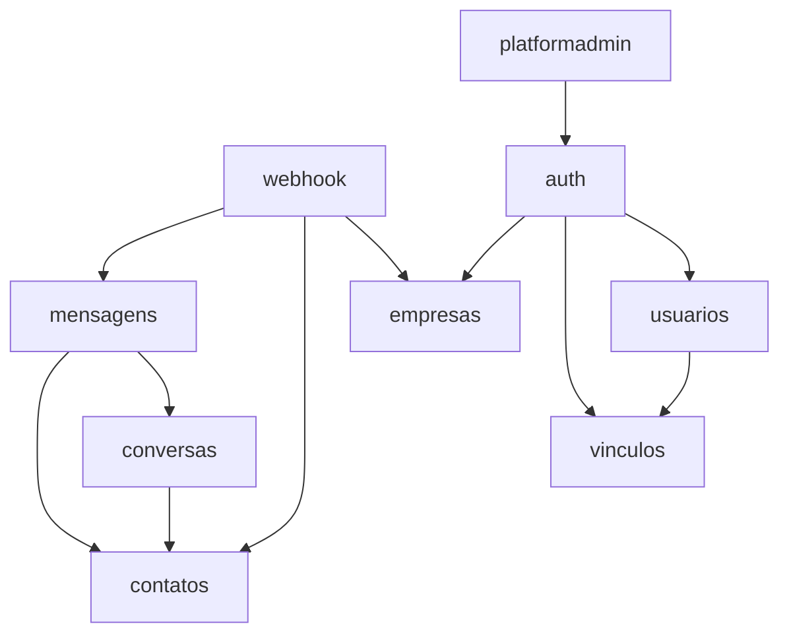

# Módulos

Organização package-by-feature sob `com.felipeduan.atendimento.modules`.
Código transversal em `shared`.

## Mapa

| Módulo | Responsabilidade |
|---|---|
| `platformadmin` | Entidade e seed do administrador da plataforma |
| `auth` | Login de tenant, troca de senha, switch de tenant |
| `empresas` | Tenants, `phone_number_id`, soft delete |
| `usuarios` | Conta global (e-mail único) |
| `vinculos` | Perfil e status por empresa (`usuario_empresa`) |
| `contatos` | Contatos do tenant |
| `conversas` | Ciclo de vida da conversa; agregado com `Mensagem` |
| `mensagens` | Recurso HTTP de mensagens (saída e entrada autenticada) |
| `webhook` | Verificação e ingestão pública assinada |
| `shared` | JWT, tenancy/RLS, segurança, erros, paginação, OpenAPI |

## Fronteiras

- Dependência entre módulos apenas via `Service`.
- `Mensagem` (entidade) reside em `conversas` (agregado Conversa–Mensagem).
  O pacote `mensagens` expõe o recurso HTTP.
- `webhook` orquestra `EmpresaService`, `ContatoService` e `MensagemService`.

## Papéis e rotas (resumo)

| Papel | Escopo típico |
|---|---|
| `PLATFORM_ADMIN` | `POST/GET/DELETE /empresas` (sem `tenant_id` no JWT) |
| `ADMINISTRADOR` | Gestão do tenant, inclusive `POST/PUT /usuarios` |
| `ATENDENTE` | Contatos, conversas, mensagens (leitura de usuários) |
| `TROCAR_SENHA` | Apenas `POST /auth/trocar-senha` |
