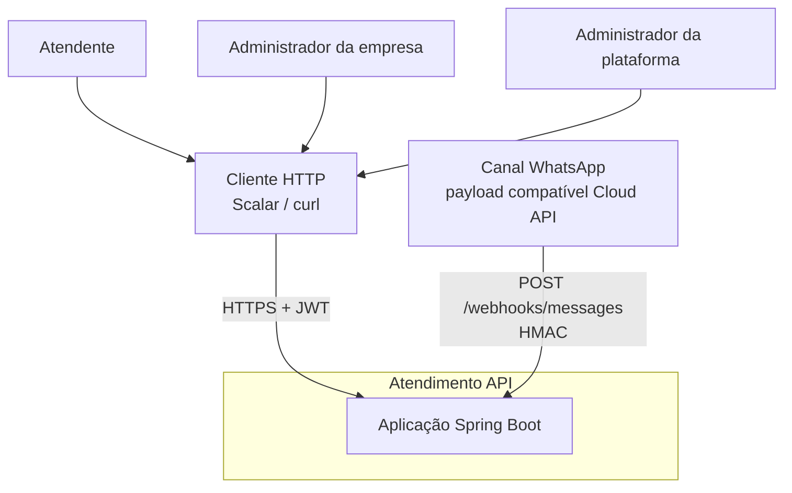
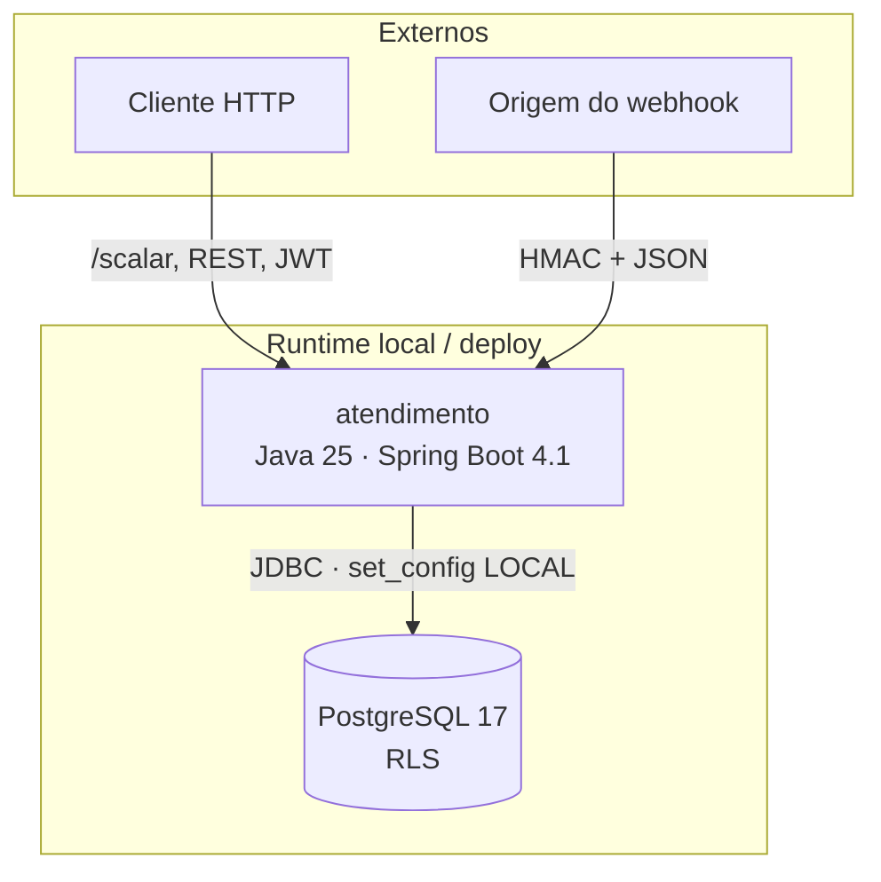
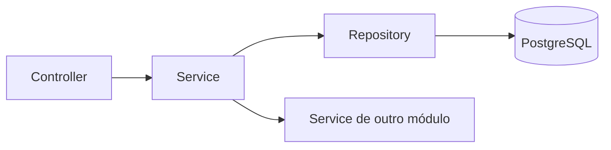

# Visão geral da arquitetura

## Contexto

Atores humanos acessam a API via cliente HTTP. Não há frontend dedicado.
O canal externo entrega mensagens no endpoint público de webhook. O envio
outbound ao provedor não faz parte do escopo atual.

## Containers

Um único processo de aplicação. Isolamento de dados no PostgreSQL (RLS).
Não há broker de mensageria.

O `compose.yaml` também sobe um contêiner Redis e o projeto declara
`spring-boot-starter-data-redis` (Testcontainers inclui Redis nos testes).
**Não há uso de cache nem de operações Redis no código de negócio atual** —
nenhum `@Cacheable`, nenhum cliente Redis de aplicação. A persistência e o
isolamento relevantes estão no PostgreSQL.

## Camadas internas (por módulo)

Convenção uniforme: `controller` / `service` / `repository` / `dto` /
`exception`. Entidades JPA concentram invariantes de domínio. Um módulo
não acessa `Repository` ou entidade de outro — apenas o `Service` público.

## Stack

| Componente | Tecnologia |
|---|---|
| Runtime | Java 25, Spring Boot 4.1 |
| Persistência | Spring Data JPA, Flyway, PostgreSQL 17 |
| Segurança | OAuth2 Resource Server (JWT HS256), Spring Security |
| Documentação HTTP | springdoc-openapi, Scalar |
| Testes | JUnit, MockMvc, Testcontainers |

## Leitura seguinte

- [Módulos](modules.md)
- [Domínio](domain.md)
- [Modelo de dados](data-model.md)
- [Tenancy](../security/tenancy.md)
