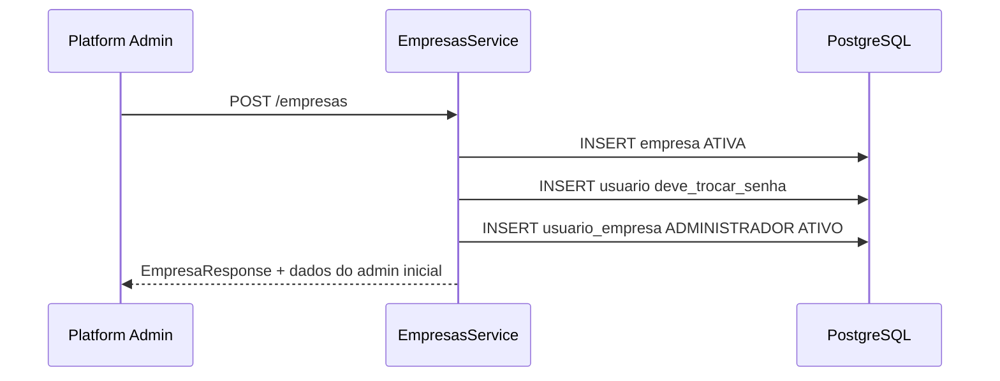

# Provisionamento de empresa

```mermaid
sequenceDiagram
  participant PA as Platform Admin
  participant API as EmpresasService
  participant DB as PostgreSQL

  PA->>API: POST /empresas
  API->>DB: INSERT empresa ATIVA
  API->>DB: INSERT usuario deve_trocar_senha
  API->>DB: INSERT usuario_empresa ADMINISTRADOR ATIVO
  API-->>PA: EmpresaResponse + dados do admin inicial
```

Apenas `PLATFORM_ADMIN`. O administrador inicial autentica com senha
temporária e é obrigado a trocar senha antes de operar o tenant.
