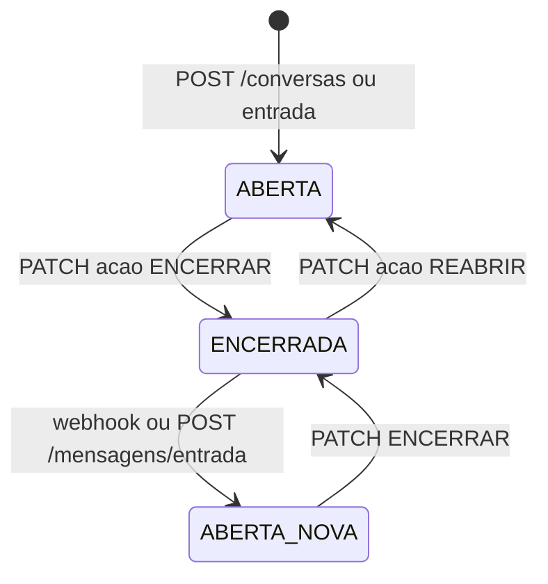

# Ciclo de vida da conversa

| Evento | Resultado |
|---|---|
| `POST /mensagens` com conversa aberta | 201, sentido SAIDA, `envioPendente: true` |
| `POST /mensagens` com conversa encerrada | **409** |
| Entrada com última conversa encerrada | Nova conversa (`previous_conversation_id`) |
| `PATCH` ENCERRAR duas vezes | **409** estado inválido |

Mensagens são listadas com `GET /mensagens?conversaId=...`, paginadas.
