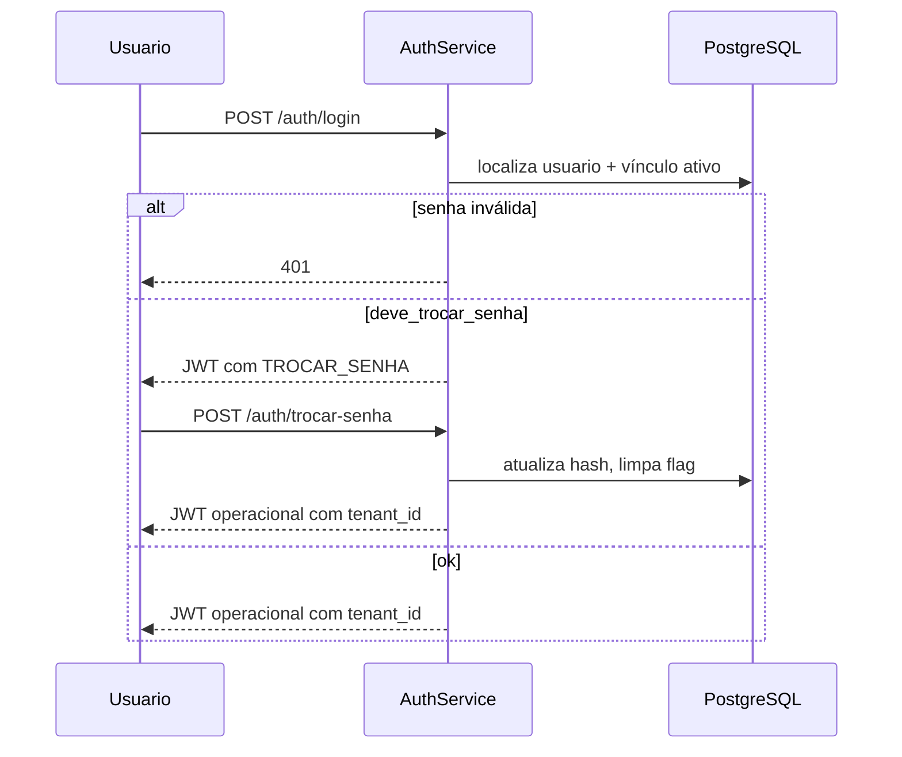

# Login e troca de senha

```mermaid
sequenceDiagram
  participant U as Usuario
  participant API as AuthService
  participant DB as PostgreSQL

  U->>API: POST /auth/login
  API->>DB: localiza usuario + vínculo ativo
  alt senha inválida
    API-->>U: 401
  else deve_trocar_senha
    API-->>U: JWT com TROCAR_SENHA
    U->>API: POST /auth/trocar-senha
    API->>DB: atualiza hash, limpa flag
    API-->>U: JWT operacional com tenant_id
  else ok
    API-->>U: JWT operacional com tenant_id
  end
```

Troca de tenant: `POST /auth/switch-tenant` com JWT válido reemite token para
outra empresa vinculada, sem senha.
