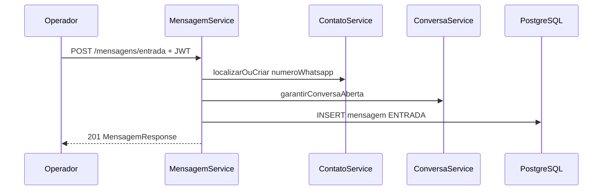

# Recepção autenticada

Endpoint: **`POST /mensagens/entrada`** (tag OpenAPI: Mensagens).

Produz o mesmo efeito de negócio do webhook (contato → conversa aberta →
mensagem de entrada → última interação), com autenticação JWT. O tenant vem
do token, não do corpo.

Uso típico: verificação no Scalar sem calcular assinatura HMAC. Não substitui
`POST /webhooks/messages` como contrato público de integração.
