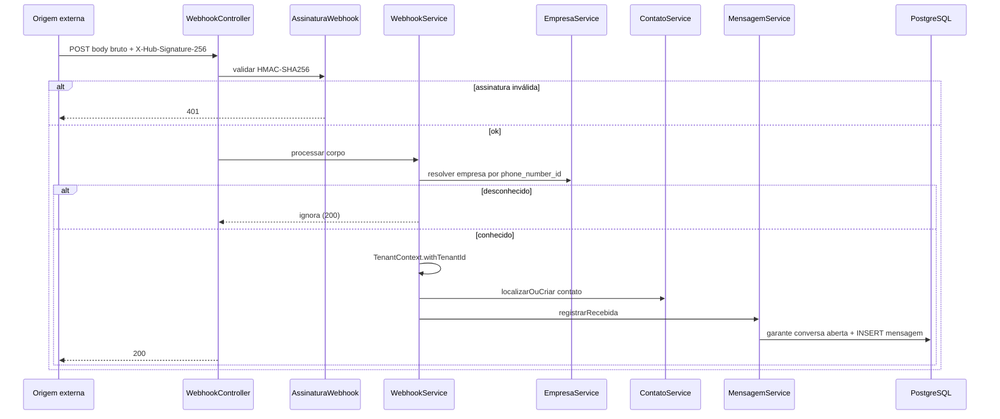

# Recepção via webhook

Endpoint exigido pelo contrato da API: **`POST /webhooks/messages`**.

Também existe `GET /webhooks/messages` para o desafio de verificação
(`hub.mode`, `hub.verify_token`, `hub.challenge`).

## Sequência

## Comportamento

| Aspecto | Comportamento |
|---|---|
| Autenticação | HMAC do corpo bruto; comparação em tempo constante |
| Tenant | Resolvido por `phone_number_id` da empresa |
| Contato | Localiza ou cria; reativa se inativo |
| Conversa | Garante aberta; se a última está encerrada, cria nova com referência |
| Idempotência | Mesmo `whatsapp_message_id` não duplica mensagem |
| Formato do body | Envelope compatível com WhatsApp Cloud API |

Este é o caminho público de ingestão. Para exercício autenticado sem HMAC,
ver [mensagem-entrada-autenticada.md](mensagem-entrada-autenticada.md).
