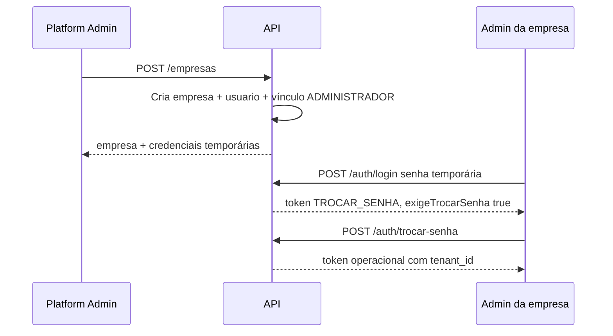

# Autenticação

## Tipos de token

| Emissor | Claims relevantes | Uso |
|---|---|---|
| `POST /auth/plataforma/login` | authorities `PLATFORM_ADMIN`, sem `tenant_id` | Gestão de empresas |
| `POST /auth/login` | `tenant_id`, perfil do vínculo | Operação no tenant |
| Após login com senha temporária | `TROCAR_SENHA` | Apenas troca de senha |
| `POST /auth/switch-tenant` | novo `tenant_id` | Mesmo usuário, outra empresa |

JWT HS256, segredo ≥ 32 bytes em variável de ambiente. TTL via
`JWT_EXPIRATION_MINUTES` (referência local no `.env.example`: 15 minutos).

## Fluxo do administrador inicial

## Endpoints

| Método | Caminho | Observação |
|---|---|---|
| `POST` | `/auth/plataforma/login` | Público |
| `POST` | `/auth/login` | Público |
| `POST` | `/auth/trocar-senha` | Requer authority `TROCAR_SENHA` |
| `POST` | `/auth/switch-tenant` | Requer usuário autenticado operacional |

Token somente com `TROCAR_SENHA` é negado em qualquer outra rota.
