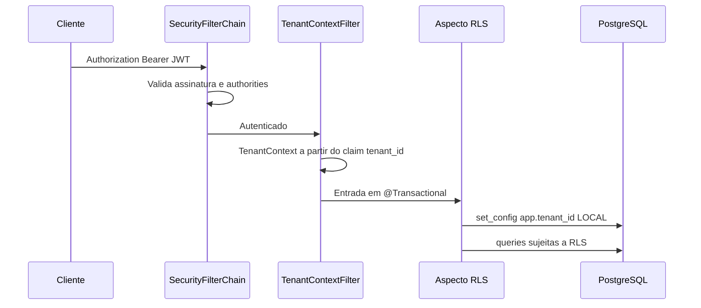

# Tenancy

## Princípio

O identificador do tenant **não** é aceito de header ou body nas rotas
autenticadas. A única fonte é o claim `tenant_id` do JWT, lido via
`TenantContext`.

Exceção: o webhook público resolve a empresa pelo `phone_number_id` do
payload e executa o processamento sob `TenantContext.withTenantId(...)`.

## Pipeline de uma requisição autenticada

## Isolamento

A suíte inclui testes de isolamento com dois tenants (contatos, vínculos e
fluxos correlatos). Recurso de outro tenant responde vazio ou **404**, nunca
com dados cruzados.

Não há camada de cache de dados de tenant no código atual; o isolamento
depende do JWT + RLS no PostgreSQL.
